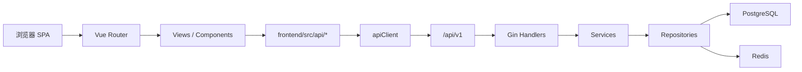
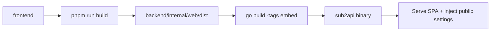
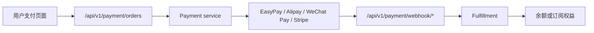

# Integration Architecture

**生成时间:** 2026-04-28  
**扫描级别:** Quick Scan

## 概览

Sub2API 的主要集成关系有三类：

1. 前端 SPA 与后端 `/api/v1` 业务 API。
2. 外部 AI 客户端与后端网关兼容 API。
3. 后端与 PostgreSQL、Redis、支付平台、OAuth provider、AI 上游账号之间的运行时集成。

## 前后端集成

关键约定：

- 前端默认 API base URL 是 `/api/v1`。
- 前端请求自动带 token、语言和 GET timezone。
- 后端业务 API 默认返回 `{ code, message, data }`。
- 前端成功时自动解包 `data`。
- 401 时前端会走 refresh token 队列，失败后跳转登录。

## 前端内嵌发布

开发模式下 Vite 代理 `/api`、`/v1`、`/setup` 到后端；生产模式下 Go 服务同时处理 API、网关和 SPA 静态资源。

## AI 网关集成

```mermaid
flowchart LR
  Client["Claude/OpenAI/Gemini/Codex 客户端"] --> GatewayRoutes["/v1 /v1beta /responses /antigravity"]
  GatewayRoutes --> APIKeyAuth["API Key + subscription/group guard"]
  APIKeyAuth --> Scheduler["Account scheduler"]
  Scheduler --> Upstream["OpenAI / Anthropic / Gemini / Antigravity"]
  Upstream --> ResponseTransform["Protocol response handling"]
  ResponseTransform --> Usage["Usage billing/log worker"]
  Usage --> DB["PostgreSQL"]
```

网关根据分组平台、账号平台和规范化端点决定上游路径。`backend/internal/handler/endpoint.go` 是端点规范化和上游端点推导的集中位置。

## 支付集成

支付 provider 实例和订单由数据库模型保存。Webhook 是关键安全边界，必须校验签名、幂等和订单状态转换。

## 运维监控集成

运维监控涉及：

- 前端 `/admin/ops` 页面。
- 后端 `/api/v1/admin/ops/*` 接口。
- 实时 WebSocket：`/api/v1/admin/ops/ws/qps`。
- 错误日志、上游错误、请求详情、系统日志、alert rules、alert events、runtime settings。
- 数据库聚合表和后台 collector/evaluator 服务。

## 外部系统与配置

- Docker Compose 部署依赖 PostgreSQL、Redis 和 `.env`。
- Caddy/Nginx 反代需要关注 headers、TLS、CSP 和 `underscores_in_headers on;`。
- S3/backup、data management agent、OAuth provider、邮件 SMTP、Turnstile 都通过后端配置接入。

## 关键风险

- 网关流式响应一旦写出，不应再切换并拼接其他上游响应。
- 计费和 usage 记录失败不能默认放行付费请求。
- OAuth/token refresh 平台差异大，不要共享错误语义。
- 前端 backend mode 和后端 backend mode guard 要保持一致。
- 时间统计必须明确 timezone。
